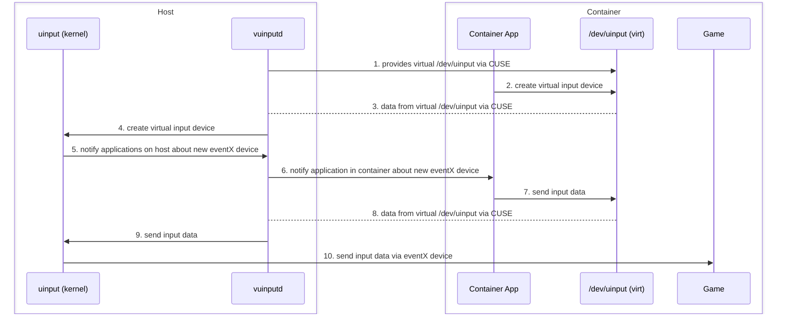

# vuinputd

**Run Sunshine and other uinput-based apps inside containers — with full input isolation and zero kernel patches.**

A minimal **CUSE-based proxy for `/dev/uinput`** that lets unmodified applications (like [Sunshine](https://github.com/LizardByte/Sunshine)) run inside containers while creating virtual input devices safely on the host.

---

## Overview

Containerizing input-producing software (e.g. Sunshine, Moonlight host replacements, remote desktop servers) improves separation and simplifies deployment.  
However, exposing the host’s `/dev/uinput` directly into a container breaks isolation:

* Containers can create devices visible system-wide or to other containers.  
* Keyboards and mice may attach to host seats or inject input into active host sessions.  

`vuinputd` exposes a virtual `/dev/uinput` device inside containers (via CUSE).
Input devices created by containerized apps are forwarded to the host kernel’s uinput subsystem, where they appear as normal `/dev/input/event*` devices visible to all host applications. Those devices are then injected into the containers with udev announcements.

---

## Architecture

`vuinputd` solves this by introducing a **mediated input stack**:

* A **fake `/dev/uinput`** inside each container.  
* A **host proxy daemon** that safely creates the actual devices via `/dev/uinput`.  
* The proxy **forwards add/remove udev events** into the container so that wayland compositors that use libinput and other applications see devices natively.  
* **udev rules** tag and isolate devices per container, preventing the host from consuming them.

Applications use the `/dev/uinput` interface unmodified, and the mediation adds **negligible overhead**.

In principle, this design works with any container runtime — **systemd-nspawn, Docker, LXC, Podman**, and others.

---

## Benefits

* 🎮 **SDL2 & Wayland compatibility:** `vuinputd` ensures compositors and games recognize input devices correctly.  
* 🔒 **Strong isolation:** Containers see only their own devices; the host sees them but ignores them completely.  
* ♻️ **Safe lifecycle:** Devices are removed cleanly when the containerized app stops.  
* 🛠️ **Simple integration:** No kernel patches required — only userspace tools and udev rules.

---

## Documentation

See [docs/BUILD.md](https://github.com/joleuger/vuinputd/blob/main/docs/BUILD.md) for a short build and installation guide.  
See [docs/DESIGN.md](https://github.com/joleuger/vuinputd/blob/main/docs/DESIGN.md) for a detailed overview of the architecture, design trade-offs, and security considerations.
See [docs/USAGE.md](https://github.com/joleuger/vuinputd/blob/main/docs/USAGE.md) for a short usage guide.

---

## 🧩 Production Readiness

**Current Status:** 🚧 *Prototype / Alpha — functional, not yet production-grade.*

`vuinputd` is currently in a functional prototype stage.
It reliably demonstrates the core concept — exposing `/dev/uinput` devices inside containers via CUSE — but several aspects require hardening before production use. 

### ✅ Goals for Production Readiness

* [ ] **Steam input support:**
  Steam input is not supported, yet. For some strange reasons, steam creates 16 virtual devices. Maybe a race.

* [ ] **Error handling and recovery:**
  Ensure the daemon gracefully handles container shutdowns, device races, and failed mounts without leaks or undefined states.

* [ ] **Security model:**
  Review privilege requirements (root access, netlink permissions, CUSE capabilities) and ideally reduce the attack surface via namespace isolation, seccomp, or capability dropping.

* [ ] **Robust startup and shutdown:**
  Add reliable cleanup of virtual devices and clear error feedback when reloading or restarting.

* [ ] **Container runtime integration:**
  Validate compatibility with major runtimes (`systemd-nspawn`, `Docker`, `LXC`, `Podman`, etc.) and document integration steps.

* [ ] **Comprehensive testing:**

  * Unit tests for the Rust core logic
  * Integration tests with multiple containers
  * Fuzz or stress testing of the CUSE layer

* [ ] **Code audit:**
  Review `unsafe` sections (from FUSE bindings) and ensure memory safety and proper lifetime handling.

* [ ] **Distribution and packaging:**
  Provide a deb/rpm package for simple deployment.

---

## License

MIT
