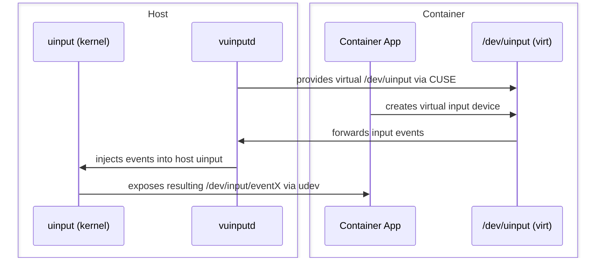

# vuinputd

**Run Sunshine and other uinput-based apps inside containers — with full input isolation and zero kernel patches.**

A minimal **CUSE-based proxy for `/dev/uinput`** that lets unmodified applications (like [Sunshine](https://github.com/LizardByte/Sunshine)) run inside containers while creating virtual input devices safely on the host.

---

## Overview

Containerizing input-producing software (e.g. Sunshine, Moonlight host replacements, remote desktop servers) improves separation and simplifies deployment.  
However, exposing the host’s `/dev/uinput` directly into a container breaks isolation:

* Containers can create devices visible system-wide or to other containers.  
* Keyboards and mice may attach to host seats or inject input into active host sessions.  

`vuinputd` exposes a virtual `/dev/uinput` device inside containers (via CUSE).
Input devices created by containerized apps are forwarded to the host kernel’s uinput subsystem, where they appear as normal `/dev/input/event*` devices visible to all host applications. Those devices are then injected into the containers with udev announcements.

---

## Architecture

`vuinputd` solves this by introducing a **mediated input stack**:

* A **fake `/dev/uinput`** inside each container.  
* A **host proxy daemon** that safely creates the actual devices via `/dev/uinput`.  
* The proxy **forwards add/remove udev events** into the container so that wayland compositors that use libinput and other applications see devices natively.  
* **udev rules** tag and isolate devices per container, preventing the host from consuming them.

Applications use the `/dev/uinput` interface unmodified, and the mediation adds **negligible overhead**.

In principle, this design works with any container runtime — **systemd-nspawn, Docker, LXC, Podman**, and others.

---

## Benefits

* 🎮 **SDL2 & Wayland compatibility:** `vuinputd` ensures compositors and games recognize input devices correctly.  
* 🔒 **Strong isolation:** Containers see only their own devices; the host sees them but ignores them completely.  
* ♻️ **Safe lifecycle:** Devices are removed cleanly when the containerized app stops.  
* 🛠️ **Simple integration:** No kernel patches required — only userspace tools and udev rules.

---

## Documentation

See [docs/BUILD.md](docs/BUILD.md) for a short build and installation guide.  
See [docs/DESIGN.md](docs/DESIGN.md) for a detailed overview of the architecture, design trade-offs, and security considerations.

---

## License

MIT
