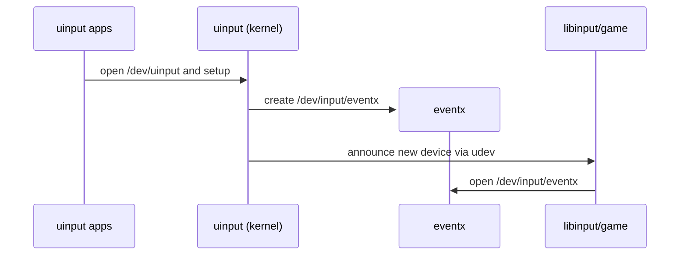
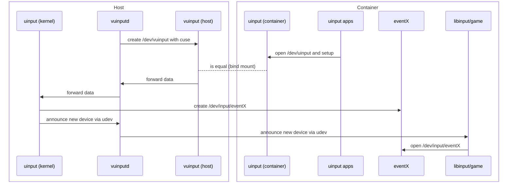

# Design Document

## 1. Introduction

This project provides a safe, general-purpose way to run [Sunshine](https://github.com/LizardByte/Sunshine) and other applications that use `/dev/uinput` **inside containers** — including `systemd-nspawn`, Docker, LXC, Podman, and similar runtimes.

Applications like Sunshine require creating virtual input devices (`/dev/uinput`) for keyboards, mice, and controllers.  
Naively bind-mounting `/dev/uinput` from the host into a container breaks isolation: a container could create devices visible to other containers or even the host, leading to unwanted input injection and security risks.

`vuinputd` introduces a **mediated `/dev/uinput` proxy** that preserves isolation without kernel changes.

---

## 2. Architecture

Normally, applications open `/dev/uinput` directly to create virtual event devices such as `/dev/input/event9`:

vuinputd provides a virtual /dev/vuinput implemented via CUSE (Character Device in Userspace).
This device can be bind-mounted into a container as /dev/uinput, so applications operate normally:

---

## 3. Design Decisions

### 3.1 Where `/dev/uinput` lives

* **Decision**: Provide a fake `/dev/vuinput` backed by host proxy. This character device can be bind mounted inside containers to `/dev/uinput`.
* **Why**: Prevents containers from creating devices visible system-wide.

### 3.2 Prevent host from using devices

* **Decision**: udev rules strip `ID_INPUT_KEYBOARD` and `ID_INPUT_MOUSE`, set `ID_SEAT=seat_vuinput`.
* **Why**: Ensures devices are invisible to host input subsystems while still available in containers.

### 3.3 udev events in containers

* **Decision**: Proxy forwards udev events into the container via netlink.
* **Why**: Without this, SDL2 and libinput might not recognize devices correctly; with it, containers behave as if devices were created locally.

### 3.4 Where to run the proxy

* **Decision**: Run proxy on host, one instance per container.
* **Why**: Only host can safely access `/dev/uinput` and enforce mediation.

### 3.5 Security trade-off

* **Decision**: Accept that host always sees devices, but enforce rules to stop it consuming them.
* **Why**: Full input namespaces don’t exist in Linux today; mediation is the practical compromise.

### 3.6 Compatibility
* **Runtimes supported:** Works with systemd-nspawn, Docker, LXC, Podman, and other container engines.  
* **Applications supported:** Any program that writes to `/dev/uinput`, including Sunshine, custom input injectors, and game streaming servers.
---

## 4. Security Considerations

`vuinputd` must currently run with **root privileges** to:

* Access `/dev/uinput` and create CUSE devices.
* Send and receive **udev/netlink** messages.
* Manage per-container device nodes under `/dev/input`.

While this design is necessary for mediation, it introduces potential attack surfaces:

### ⚠️ Risks

* **Privilege escalation:** a compromised container could exploit bugs in the proxy.
* **Input injection:** if isolation fails, input devices may leak between containers.
* **Unsafe FUSE/`unsafe` code:** any memory or pointer error could lead to denial-of-service or privilege abuse.

### 🛡️ Mitigations (planned / recommended)

* [ ] Drop capabilities after startup (e.g. keep only `CAP_SYS_ADMIN` where needed).
* [ ] Run under a dedicated **system user** (`vuinputd`) with limited filesystem access.
* [ ] Enforce **container identity** using cgroup, namespace, or pidfd checks.
* [ ] Use **seccomp** or `systemd` sandboxing (`ProtectSystem`, `ProtectKernelTunables`, `RestrictNamespaces`, etc.).
* [ ] Eventually migrate to **Rust-native FUSE/Netlink** bindings to remove unsafe dependencies.

## 5. Alternative Approaches

### 5.1 trace accesses of /dev/uinput with eBPF

**Idea (short):** attach an eBPF program to the syscall tracepoint for `ioctl` (`tracepoint/syscalls/sys_enter_ioctl`), filter by container cgroup, and send small events (pid, tgid, fd, cmd, timestamp, short payload sample) to userspace using the BPF ring buffer. A privileged host agent consumes the ringbuf events, duplicates the target FD via `pidfd_getfd()` and proceeds with UI_GET_SYSNAME / sysfs resolution to retrieve the sys-path and the dev-path. Having the dev-path and the pid of the container, the solution could proceed as in the current solution.

#### 1) Trace hook: `tracepoint/syscalls/sys_enter_ioctl`

Use the *syscall tracepoint* `syscalls:sys_enter_ioctl`. Tracepoints are stable, exported kernel probe points and the syscall tracepoint provides the syscall arguments (fd, cmd, arg) in a stable layout. This avoids fragile kprobe offsets on architecture-specific syscall wrappers. See the kernel tracepoint docs.

#### 2) BPF map: ring buffer (kernel → userspace)

Use the BPF ring buffer (`BPF_MAP_TYPE_RINGBUF`) to cheaply publish fixed-size events to userspace. The ring buffer provides `bpf_ringbuf_reserve()` / `bpf_ringbuf_submit()` semantics from the kernel side and is the recommended modern replacement for perf-buf for high-rate kernel→user events. See the kernel documentation for the ring buffer API.

#### 3) Useful eBPF helpers

Inside the trace program you will typically use:

* `bpf_get_current_pid_tgid()` to record tgid/pid,
* `bpf_get_current_cgroup_id()` to filter to the container cgroup you care about,
* `bpf_copy_from_user()` to safely copy up to `N` bytes from the user pointer (`arg`) into the event buffer.

#### 4) Use of `pidfd_getfd`
The **`pidfd_getfd()`** syscall (introduced in Linux 5.6, see `man pidfd_getfd(2)`) allows one process to **duplicate a file descriptor from another process** into its own FD table. It takes a *pidfd* (obtained via `pidfd_open()` or from `CLONE_PIDFD`), the target FD number in the remote process, and optional flags. The resulting descriptor refers to the **same open file description**—sharing offset, status flags, and driver state—exactly as if the target process had called `dup()`. Permission checks apply: the caller must either share credentials (same UID) or hold `CAP_SYS_PTRACE` or an equivalent capability over the target. This makes `pidfd_getfd()` the canonical and race-free way to inspect or reuse another process’s device handles (for example, to run `UI_GET_SYSNAME` on a client apps' fd on `/dev/uinput` ) without invasive ptrace tricks.
