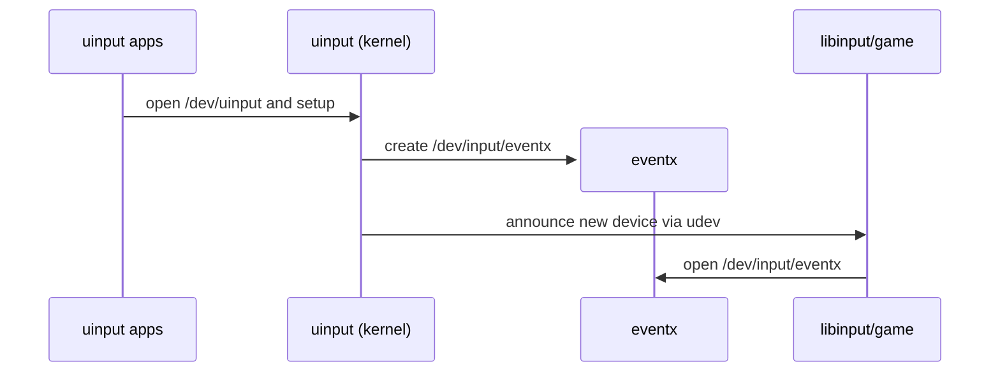
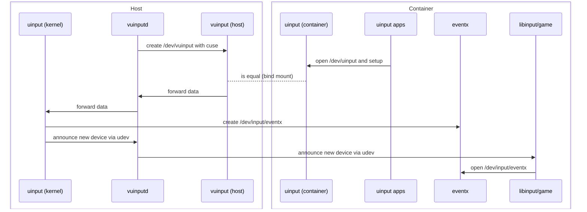

# Design Document

## 1. Introduction

This project provides a safe way to run [Sunshine](https://github.com/LizardByte/Sunshine) inside `systemd-nspawn` containers.
Sunshine requires creating virtual input devices (`/dev/uinput`) for keyboards, mice, and controllers.

Naively exposing `/dev/uinput` from the host into a container breaks isolation: containers could create devices visible to other containers, and the host could even start consuming those devices.

---
## 2. Architecture

Usually, uinput apps like sunshine open the /dev/uinput interface of the kernel to create a new artificial event device like /dev/input/event9

vuinputd provides a virtual uinput called /dev/vuinput that can be bind-mounted as /dev/uinput in the container. Thus, uinput devices can also be created inside containers:

---

## 2. Design Decisions

### 2.1 Where `/dev/uinput` lives

* **Decision**: Provide a fake `/dev/vuinput` backed by host proxy. This character device can be bind mounted inside containers to `/dev/uinput`.
* **Why**: Prevents containers from creating devices visible system-wide.

### 2.2 Prevent host from using devices

* **Decision**: udev rules strip `ID_INPUT_KEYBOARD` and `ID_INPUT_MOUSE`, set `ID_SEAT=seat_vuinput`.
* **Why**: Ensures devices are invisible to host input subsystems while still available in containers.

### 2.3 udev events in containers

* **Decision**: Proxy forwards udev events into the container via netlink.
* **Why**: Without this, SDL2 and libinput might not recognize devices correctly; with it, containers behave as if devices were created locally.

### 2.4 Where to run the proxy

* **Decision**: Run proxy on host, one instance per container.
* **Why**: Only host can safely access `/dev/uinput` and enforce mediation.

### 2.5 Security trade-off

* **Decision**: Accept that host always sees devices, but enforce rules to stop it consuming them.
* **Why**: Full input namespaces don’t exist in Linux today; mediation is the practical compromise.
