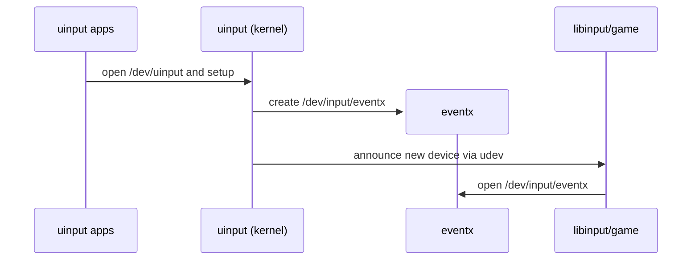
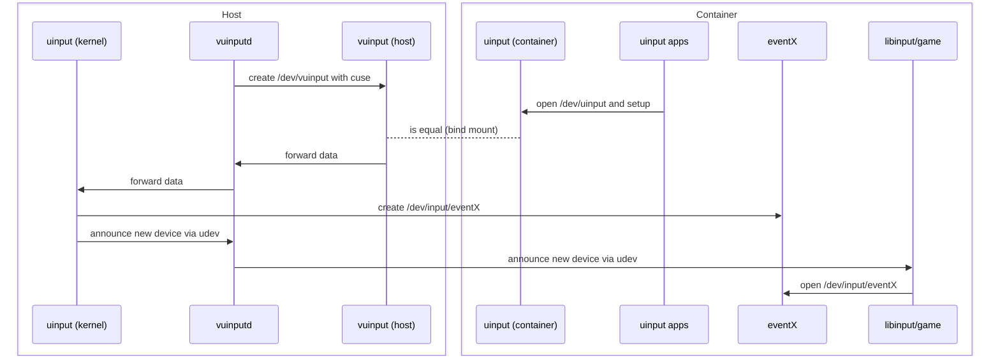

# Design Document

## 1. Introduction

This project provides a safe, general-purpose way to run [Sunshine](https://github.com/LizardByte/Sunshine) and other applications that use `/dev/uinput` **inside containers** — including `systemd-nspawn`, Docker, LXC, Podman, and similar runtimes.

Applications like Sunshine require creating virtual input devices (`/dev/uinput`) for keyboards, mice, and controllers.  
Naively bind-mounting `/dev/uinput` from the host into a container breaks isolation: a container could create devices visible to other containers or even the host, leading to unwanted input injection and security risks.

`vuinputd` introduces a **mediated `/dev/uinput` proxy** that preserves isolation without kernel changes.

---

## 2. Architecture

Normally, applications open `/dev/uinput` directly to create virtual event devices such as `/dev/input/event9`:

vuinputd provides a virtual /dev/vuinput implemented via CUSE (Character Device in Userspace).
This device can be bind-mounted into a container as /dev/uinput, so applications operate normally:

---

## 3. Design Decisions

### 3.1 Where `/dev/uinput` lives

* **Decision**: Provide a fake `/dev/vuinput` backed by host proxy. This character device can be bind mounted inside containers to `/dev/uinput`.
* **Why**: Prevents containers from creating devices visible system-wide.

### 3.2 Prevent host from using devices

* **Decision**: udev rules strip `ID_INPUT_KEYBOARD` and `ID_INPUT_MOUSE`, set `ID_SEAT=seat_vuinput`.
* **Why**: Ensures devices are invisible to host input subsystems while still available in containers.

### 3.3 udev events in containers

* **Decision**: Proxy forwards udev events into the container via netlink.
* **Why**: Without this, SDL2 and libinput might not recognize devices correctly; with it, containers behave as if devices were created locally.

### 3.4 Where to run the proxy

* **Decision**: Run proxy on host, one instance per container.
* **Why**: Only host can safely access `/dev/uinput` and enforce mediation.

### 3.5 Security trade-off

* **Decision**: Accept that host always sees devices, but enforce rules to stop it consuming them.
* **Why**: Full input namespaces don’t exist in Linux today; mediation is the practical compromise.

### 3.6 Compatibility
* **Runtimes supported:** Works with systemd-nspawn, Docker, LXC, Podman, and other container engines.  
* **Applications supported:** Any program that writes to `/dev/uinput`, including Sunshine, custom input injectors, and game streaming servers.
---

## 4. Security Considerations

`vuinputd` must currently run with **root privileges** to:

* Access `/dev/uinput` and create CUSE devices.
* Send and receive **udev/netlink** messages.
* Manage per-container device nodes under `/dev/input`.

While this design is necessary for mediation, it introduces potential attack surfaces:

### ⚠️ Risks

* **Privilege escalation:** a compromised container could exploit bugs in the proxy.
* **Input injection:** if isolation fails, input devices may leak between containers.
* **Unsafe FUSE/`unsafe` code:** any memory or pointer error could lead to denial-of-service or privilege abuse.

### 🛡️ Mitigations (planned / recommended)

* [ ] Drop capabilities after startup (e.g. keep only `CAP_SYS_ADMIN` where needed).
* [ ] Run under a dedicated **system user** (`vuinputd`) with limited filesystem access.
* [ ] Enforce **container identity** using cgroup, namespace, or pidfd checks.
* [ ] Use **seccomp** or `systemd` sandboxing (`ProtectSystem`, `ProtectKernelTunables`, `RestrictNamespaces`, etc.).
* [ ] Eventually migrate to **Rust-native FUSE/Netlink** bindings to remove unsafe dependencies.
