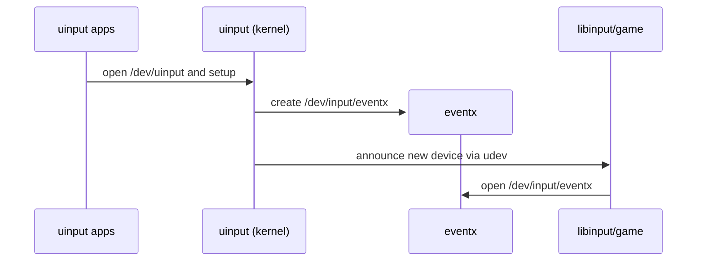
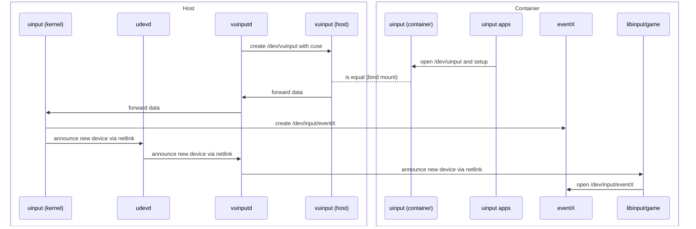

# Design Document

## 1. Introduction

This project provides a safe, general-purpose way to run [Sunshine](https://github.com/LizardByte/Sunshine), Steam Input, and other applications that use `/dev/uinput` **inside containers** — including `systemd-nspawn`, Docker, LXC, Podman, and similar runtimes.

Applications like Sunshine require creating virtual input devices (`/dev/uinput`) for keyboards, mice, and controllers.  
Naively bind-mounting `/dev/uinput` from the host into a container breaks isolation: a container could create devices visible to other containers or even the host, leading to unwanted input injection and security risks.

`vuinputd` introduces a **mediated `/dev/uinput` proxy** that preserves isolation without kernel changes.

---

## 2. Architecture

Normally, applications open `/dev/uinput` directly to create virtual event devices such as `/dev/input/event9`:



vuinputd provides a virtual /dev/vuinput implemented via CUSE (Character Device in Userspace).
This device can be bind-mounted into a container as /dev/uinput, so applications operate normally:


`vuinputd` forwards udev events into the container via netlink, because otherwise the game in the container would not recognize when its net namespace is different from the one of udevd.


---

## 3. Design Decisions

This section describes *why* the architecture works, which invariants it relies on, and why the implementation is correct given the constraints of `/dev/uinput`, udev, containers, CUSE, and Rust’s async model.

The key idea: **vuinputd linearizes the requests to create or destroy devices from a container**, and replays the linearized device generation actions in the container in a strict order per container.

---

## **3.1 Source of Truth: The CUSE Device (`/dev/vuinput`)**

### **Decision**

The only authoritative source of truth about devices is the set of **active clients connected to the CUSE implementation** (`/dev/vuinput`).

### **Rationale**

Clients intentionally open `/dev/uinput` to create virtual devices.
Those clients → via the container → bind mount → map to `/dev/vuinput` host-side.

Therefore:

* **Every relevant device originates from an explicit open() request**
* Clients *must* communicate the device’s lifetime to vuinputd (via file handle lifetime)
* The daemon can unambiguously map:

  * which container the client belongs to (from CUSE file handle metadata)
  * which input devices belong to which client
  * when a client terminates (file descriptor closes)

---

## **3.2 Event Dispatcher and Job Engine**

The system uses a **single-threaded job engine** that processes events sequentially. Job
This engine runs:

* udev events
* internal jobs (hotplug propagation, cleanup, reconciliation)

CUSE events (open, ioctl, write, close) happen in a separate thread and may trigger jobs in the job engine.

### **Decision**

Use a “logically single-threaded” dispatcher with async/await for I/O.

### **Why this is correct**

Even though Rust’s async runtime may move tasks between OS threads, the dispatcher ensures:

* only **one mutation** happens at a time
* jobs should be relatively short or have async waiting points (awaits)
* async I/O does not break ordering, because state mutations always occur inside the central job loop

### **Invariants ensured**

1. **No two jobs mutate global state concurrently**
2. **All jobs are serialized**
3. **Await points do not allow interleaving jobs affecting the same container**
5. **Awaiting in one container allows progress in another container**

This is the core of correctness.

### **Implementation Details on the job engine**

This subsection documents the concrete behaviour, invariants and policies implemented by the Dispatcher (the job engine). It is intentionally precise and maps to the code: `src/jobs/*` and `src/jobs/job.rs`.

**What the Dispatcher is**

* A logically single-threaded job executor that serializes *all* state-mutating work.
* Implementation lives in `src/jobs/job.rs` (type `Dispatcher`) and `src/jobs/*`.

**Core job targets / types**

* `JobTarget::Host` — host-global jobs (maintenance, one of jobs).
* `JobTarget::BackgroundLoop` — long-lived background tasks (udev monitor loop).
* `JobTarget::Container(RequestingProcess)` — per-container jobs, strictly ordered per container.

**Common concrete jobs (examples)**

* `InjectInContainerJob` — create device node in container, write udev runtime data, send udev add.
* `RemoveFromContainerJob` — remove device node, delete runtime data, send udev remove.
* `MonitorBackgroundLoop` — reads host udev events and populates `EVENT_STORE`.

**Ordering guarantees**

* Jobs are FIFO per `JobTarget`.
* BackgroundLoop jobs are spawned independent of per-target queues.
* The dispatcher may spawn new per-target loops lazily on first job.
* No two jobs for the same `JobTarget` run concurrently.

**Why this matters**

* Strict serialization per target prevents device lifecycle races (create/remove) for a given container.
* Global or host-level jobs are separate so they don't block per-container sequencing.

**Code pointers**

* Dispatcher implementation: `src/jobs/job.rs` (`Dispatcher`, `get_or_spawn_target_loop`, `job_target_loop`)
* Per-target job queues: `async_channel::unbounded()`
* Background loop registration: `JobTarget::BackgroundLoop` special-case spawning
* Event storage: `src/monitor_udev.rs` (`EVENT_STORE`) — jobs read and consume entries from it
* Example jobs: `src/container/inject_in_container_job.rs`, `src/container/remove_from_container_job.rs`, `src/monitor_udev.rs` (background)

---

## **3.3 Combined Queue: Creation, Updates, Cleanup**

### **Decision**

A *single* queue per container holds all jobs affecting this container.

### **Why a single queue is correct**

Because events must follow strict causality:

* A CUSE open → must be followed by corresponding uinput device creation
* A cleanup (fd closed) → must be applied before the device is reused
* forwarding events → must happen after device creation is fully committed

Executing the jobs directly would create opportunities for:

* unintended interleavings ors reorderings
* partially applied lifecycle transitions
* delivering udev signals before device registration
* cleanup before creation
* or worse — cleanup of a new device based on stale IDs

A single queue avoids all of this.

### **Why ordering issues cannot happen**

Because:

* the dispatcher processes events strictly FIFO
* each mutation step is atomic
* every step sees consistent internal state
* cleanup is just another state transition, not a special phase

---

## **3.4 Device State Model and Convergence**

Every device is represented by a state machine:

```
Nonexistent → Creating → Live → PendingCleanup → Removed
```

The key correctness property:

### **Decision**

State transitions are monotonic and idempotent.

### **Meaning**

If the dispatcher sees any event (udev add/remove, client close, reconciliation trigger), it will:

1. re-evaluate the device's intended state
2. re-evaluate the observed state
3. compute the delta
4. run the next monotonic transition

This ensures:

* No transition can "undo" a future one
* Unexpected udev events (late, missing, reordered) cannot create inconsistencies
* A device will *eventually* reach correct state regardless of event order

### **Why this guarantees correctness**

As long as:

* intended state is derived solely from CUSE clients
* observed state is derived from udev
* transitions are deterministic and monotonic

the system **always converges** to the correct overall state.
This is CRDT-like behaviour (convergent replicated state machine), but simpler.

---

## **3.5 Integration with Container Runtimes**

### **Decision**

Every host-created `/dev/input/eventX` is tagged:

* `ID_SEAT=seat_vuinput`
* stripped of `ID_INPUT_KEYBOARD=1`, `ID_INPUT_MOUSE=1`
* placed into the correct container’s device namespace via bind-mount, cgroup association, or namespace logic

### **Rationale**

The host must:

* see device nodes (kernel requires this)
* but must *not* consume them
* while containers must believe they were created locally

### **Why tagging is correct**

On the host:

* libinput ignores devices with no `ID_INPUT_*`
* tag-based routing ensures correct multi-container isolation
* per-container udev forwarding ensures applications like SDL/libinput behave normally

Inside containers:

* the device node exists
* udev hotplug events are synthesized and delivered
* container-side libraries operate normally

---

## **3.6 Cleanups and Race-Free Destruction**

### **Decision**

Cleanup is triggered by:

* CUSE fd closure
* udev “remove” events
* container teardown
* daemon shutdown
* late reconciliation jobs

Cleanup **does not need to be a dedicated final phase** — it is part of normal operation.

### **Why no race conditions**

Because:

1. cleanup is just another serialized job in the dispatcher
2. cleanup transitions are monotonic (“Live → PendingCleanup → Removed”)
3. device destruction happens only after:

   * CUSE client is gone
   * forwarding is complete
   * all references are released
4. udev “remove” events are treated as hints, not authoritative commands

### **Result**

No “use after free”, no double cleanup, no ghost devices.

---

## **3.7 Why This Implementation Is Correct**

The design is correct because it satisfies:

### **Correctness Criteria**

1. **Isolation**
   Containers cannot interfere with each other or with host input.

2. **Safety**
   Device lifecycle is serialized, deterministic, and race-free.

3. **Eventual Convergence**
   Regardless of event order, the system converges to the correct set of live devices.

4. **Compatibility**
   Applications requiring `/dev/uinput` behave identically to native host execution.

### **Proof Sketch**

Because:

* the dispatcher is single-threaded at the logical mutation level
* intended state is derived from a single authoritative source (CUSE)
* observed state from udev never overrides intended state
* transitions are monotonic and idempotent
* cleanup is serialized and non-destructive to future transitions

→ The system behaves like a deterministic state machine and cannot diverge.

---

## 3.8 Implementation notes on the CUSE front-end (open/write/ioctl/release)

**Summary**
The CUSE front-end implements `/dev/vuinput` and maps guest operations to host actions. It is *not* a passive pipe; it holds per-handle state and must obey the dispatcher rules: short-running operations in CUSE callbacks (data-plane), heavy or state-mutating operations scheduled as dispatcher jobs (control-plane). The module therefore has two responsibilities:

* **Per-handle data plane**: parse/wrap ioctls, translate writes (input_event → uinput), handle legacy vs compat event formats, produce SYN events.
* **Control-plane dispatching**: schedule `InjectInContainerJob`, `RemoveFromContainerJob` (and other lifecycle jobs) and wait on their completion.

**Blocking / IO in callbacks**

CUSE callbacks must not perform long-blocking work on the FUSE thread. Long operations (mknod, writing `/run/udev/data`, sending netlink, waiting for container namespace exec) must be executed in jobs dispatched to the Dispatcher. If a callback must wait for job completion, it must use a small wait primitive (condvar) to block only the caller thread for as little as necessary and avoid locking dispatcher mutexes while waiting.

*Why:* reduce risk of deadlock and avoid starving other FUSE callbacks.

**IOCTL handling policy**

Variable-length ioctls are handled by using `fuse_reply_ioctl_retry` to request correct buffer sizing. The callback must validate sizes and respond with `fuse_reply_ioctl_retry` only when necessary, otherwise reply directly. Special-case ioctls (UI_DEV_CREATE, UI_DEV_DESTROY, UI_DEV_SETUP, UI_GET_SYSNAME, UI_GET_VERSION) must be handled on the data plane and schedule control jobs for side effects.

**Compat/Alignment & memory-safety**

All pointer-to-userdata handling must be done with `read_unaligned` or copying into properly aligned stack locals before creating slices or reinterpreting them. Do not retain pointers into ephemeral stack memory across writes; create owned buffers for any data that must survive until the next syscall.

**Error reporting & log dedup**

CUSE front-end deduplicates repeating errors (write failures) to reduce log spam but must still emit at least one full diagnostic with device identifiers (filehandle, devnode, major:minor, container). Deduplication should not hide critical first-occurrence context.

*Why:* helps debugging without overwhelming logs.

**Response semantics**

Use the correct FUSE reply: `fuse_reply_open`, `fuse_reply_write`, `fuse_reply_ioctl` for success; `fuse_reply_err` for error codes; `fuse_reply_none` for `release` where appropriate. Do not reply with error code 0 using `fuse_reply_err` — prefer `fuse_reply_none` or the matching success reply.

*Why:* avoid confusing FUSE/kernel semantics and accidental error returns.

**Resource lifecycle & refcounts**

Per-handle state is stored as `Arc<Mutex<VuInputState>>`. CUSE callbacks must hold only short-lived locks. When a handle is closed, the release callback must remove the state via a dispatcher job if needed and then release its Arc; any long-running cleanup must be scheduled.

*Why:* prevents deadlocks and reference cycles.

**Blocking while awaiting job completion**

If a callback synchronously waits for job completion (the current implementation uses a Condvar awaiter), it must not hold any global locks (Dispatcher lock, global state lock) while waiting. The wait must be limited and should log timeouts when exceeded.

*Why:* prevents deadlocks (dispatcher needs that same mutex to execute jobs).

**Compatibility & architecture notes**

When mapping 32-bit compat input_event formats into 64-bit representation, copy data into properly aligned locals and then write; do not create slices pointing at temporaries. Provide clear tests for compat conversion for each architecture supported.

*Why:* correctness across bitness.

**Single-threaded CUSE in foreground mode**

No high volume of events expected where we could benefit from multiple threads. But much of the code is already prepared for multithreading, if there is really demand.

---

## 3.9 Overriding the type, vendor id, and product id

During the creation of the device, the type, vendor id, and product id will be 
- type: BUS_USB 0x3
- vendor id: 0x1209,
- product id: 0x5020.

BUS_VIRTUAL 0x6 is not used, because I couldn't find a place where I could register a vendor and product id. The now used combination is unique, as the product id is registered under [pid.codes](https://pid.codes/1209/5020/). So, there is no problem to use it in a system-wide hwdb-file for udev.

---

## **3.10 Namespace Switching After Exec**

### **Decision**

`vuinputd` and its helper actions are executed in the **host mount namespace**, and only **after process startup** do they switch into the target container’s namespaces using `setns()` (e.g. `CLONE_NEWNS`, `CLONE_NEWNET`).

Dynamic libraries (e.g. `libc`, `libfuse3`, `libudev`) are therefore resolved and mapped **before** entering the container’s mount namespace.  
After the namespace switch, the process guarantees that it only performs filesystem operations intended for the container environment.

### **Rationale**

This design intentionally separates **code loading** from **runtime filesystem semantics**:

* ELF loading and dynamic linking are one-time operations performed at `execve()`
* already-mapped libraries are unaffected by later namespace changes
* mount namespaces only affect *future* path resolution, not existing mappings

By switching namespaces after startup, `vuinputd` avoids assumptions about:

* the presence of shared libraries inside the container
* libc / dynamic loader compatibility across distributions
* static linking availability for complex dependencies like `libfuse`

At the same time, runtime behavior (device access, `/dev`, `/sys`, `/proc`) correctly reflects the container’s view once `setns()` has completed.

### **Why post-exec `setns()` is correct**

* Widely used by container runtimes and helpers (e.g. `runc`, `crun`, `systemd-nspawn`, `nsenter`)
* Ensures maximum compatibility with heterogeneous container filesystems
* Avoids brittle static builds and duplicated dependency trees
* Preserves security boundaries: namespace changes are explicit and minimal

### **Constraints and Guarantees**

To keep this model correct, `vuinputd` enforces:

* namespace switching occurs before spawning threads
* no unintended filesystem access occurs before `setns()`
* all container-visible paths are accessed only after entering the target namespace
* required kernel interfaces (`/dev/fuse`, `/sys`, `/proc`) are provided by the container

Under these constraints, post-exec namespace switching provides a robust and predictable execution model.

### **Alternatives Considered**

* **Fully static binaries**  
  Rejected due to complexity, limited library support, and reduced portability.

* **Executing entirely inside the container filesystem**  
  Rejected due to dependency availability, loader ABI mismatch, and tighter coupling between host and container environments.

* **Executing the logic directly without an exec**

  This was the approach used in vuinputd releases 0.1 and 0.2:  
  the daemon would `fork()` and immediately execute the action logic in the child
  without performing an `execve()`.

  While this avoids process re-initialization overhead, it is fundamentally unsafe
  in a multi-threaded program.

  In particular:

  * `fork()` only duplicates the calling thread
  * other threads may hold internal libc locks at the time of the fork
  * common subsystems (notably `malloc`) are not async-signal-safe after `fork()`
  * any allocation or lock acquisition in the child can deadlock permanently

  This is not a theoretical concern: if another thread holds the `malloc` arena lock
  at the time of `fork()`, the child process may block forever on its first allocation,
  including implicit allocations inside libc or Rust runtime code.
  See also [https://github.com/rust-lang/rust/blob/c1e865c/src/libstd/sys/unix/process.rs#L202
  and https://systemd.io/ARCHITECTURE/ .

The chosen approach offers the best balance between correctness, portability, and operational simplicity.


---

## 4. Security Considerations

`vuinputd` must currently run with **root privileges** to:

* Access `/dev/uinput` and create CUSE devices.
* Send and receive **udev/netlink** messages.
* Manage per-container device nodes under `/dev/input`.

While this design is necessary for mediation, it introduces potential attack surfaces:

### ⚠️ Risks

* **Privilege escalation:** a compromised container could exploit bugs in the proxy.
* **Input injection:** if isolation fails, input devices may leak between containers.
* **Unsafe FUSE/`unsafe` code:** any memory or pointer error could lead to denial-of-service or privilege abuse.

### 🛡️ Mitigations (planned / recommended)

* [ ] Drop capabilities after startup (e.g. keep only `CAP_SYS_ADMIN` where needed).
* [ ] Run under a dedicated **system user** (`vuinputd`) with limited filesystem access.
* [ ] Enforce **container identity** using cgroup, namespace, or pidfd checks.
* [ ] Use **seccomp** or `systemd` sandboxing (`ProtectSystem`, `ProtectKernelTunables`, `RestrictNamespaces`, etc.).
* [ ] Eventually migrate to **Rust-native FUSE/Netlink** bindings to remove unsafe dependencies.


## 5. Background: How are input devices created by the kernel using uinput

We need to know in which order device nodes and netlink messages are sent by the linux infrastructure when uinput is used directly in order to correctly replicate the behavior. This is what this section is about. The externally visible state is determined by actions originating from the following locations:
1) userspace:  
application uses ioctl UI_DEV_CREATE on an open file handle of `/dev/uinput`
2) the linux kernel (device creation):
PART 1) Registering the uinput device. 
Entry point is uinput_ioctl_handler() in [uinput.c](https://github.com/torvalds/linux/blob/master/drivers/input/misc/uinput.c)
2.1)  uinput_create_device() in [uinput.c](https://github.com/torvalds/linux/blob/master/drivers/input/misc/uinput.c)
2.1.1) input_register_device() in [input.c](https://github.com/torvalds/linux/blob/master/drivers/input/input.c)
2.1.1.1) device_add() in [core.c](https://github.com/torvalds/linux/blob/master/drivers/base/core.c)
2.1.1.1.1) device_create_file() in [core.c](https://github.com/torvalds/linux/blob/master/drivers/base/core.c): create the sysfs attribute file for the device.
2.1.1.1.2) create diverse symlinks and data for the sysfs entry
2.1.1.1.3) create node via devtmpfs is skipped, because there is no node for a uinput device
2.1.1.1.4) kobject_uevent() in [kobject_uevent](https://github.com/torvalds/linux/blob/master/lib/kobject_uevent.c) notifies user space via netlink with `DEVPATH` set to the sysfs entry under `/sys`, e.g., `/devices/virtual/input/input155`
2.1.1.2) input_attach_handler() in [input.c](https://github.com/torvalds/linux/blob/master/drivers/input/input.c)
PART 2) Registering the evdev device.  
Note that evdev_handler is registered as an input_handler during the initialization of evdev in [evdev.c](https://github.com/torvalds/linux/blob/master/drivers/input/evdev.c)
2.1.1.2.1) evdev_connect() in [evdev.c](https://github.com/torvalds/linux/blob/master/drivers/input/evdev.c)
2.1.1.2.1.1) cdev_device_add() in [char_dev.c](https://github.com/torvalds/linux/blob/master/fs/char_dev.c)
2.1.1.2.1.1.1) device_add() in [core.c](https://github.com/torvalds/linux/blob/master/drivers/base/core.c)
2.1.1.2.1.1.1.1) device_create_file() in [core.c](https://github.com/torvalds/linux/blob/master/drivers/base/core.c): creates the sysfs attribute file for the device.
2.1.1.2.1.1.1.2) create diverse symlinks and data for the sysfs entry
2.1.1.2.1.1.1.3) create node via devtmpfs
2.1.1.2.1.1.1.3.1) devtmpfs_create_node() in [devtmpfs.c](https://github.com/torvalds/linux/blob/master/drivers/base/devtmpfs.c) creates `/dev/input/eventY`. name is determined by input_devnode() in [input.c](https://github.com/torvalds/linux/blob/master/drivers/input/input.c) which was set via dev_set_name in [evdev.c](https://github.com/torvalds/linux/blob/master/drivers/input/evdev.c)
2.1.1.2.1.1.1.4) kobject_uevent() in [kobject_uevent.c](https://github.com/torvalds/linux/blob/master/lib/kobject_uevent.c) notify user space via netlink with `DEVPATH` set to the sysfs entry under `/sys`, e.g., `/devices/virtual/input/input155/event12`
3) udev in userspace (TODO)
- udev_event_execute_rules() in [udev-event.c](https://github.com/systemd/systemd/blob/main/src/udev/udev-event.c#)


The uinput device created by PART 1 is only exposed through sysfs, still represented by struct device, but does not correspond to a char device node. The evdev device created by PART 2 is exposed through sysfs and has also a major and a minor. Thus, the order is:
1) open uinput
2) create devices/virtual/input/inputX
3) netlink KERNEL DEVPATH=/devices/virtual/input/inputX
4) create /sys/devices/virtual/input/inputX/eventY
5) create /dev/input/eventY
6) netlink KERNEL DEVPATH=/devices/virtual/input/inputX/eventY


Example of kernel messages that were send via netlink

```
KERNEL[1674737.476205] add      /devices/virtual/input/input155 (input)
ACTION=add
DEVPATH=/devices/virtual/input/input155
SUBSYSTEM=input
PRODUCT=3/beef/dead/0
NAME="Example device"
PROP=0
EV=7
KEY=10000 0 0 0 0
REL=3
MODALIAS=input:b0003vBEEFpDEADe0000-e0,1,2,k110,r0,1,amlsfw
SEQNUM=18608

KERNEL[1674737.476328] add      /devices/virtual/input/input155/event12 (input)
ACTION=add
DEVPATH=/devices/virtual/input/input155/event12
SUBSYSTEM=input
DEVNAME=/dev/input/event12
SEQNUM=18610
MAJOR=13
MINOR=76
```

Example of udev (after adding the hwdb and rules entries)
```
UDEV  [1674737.478882] add      /devices/virtual/input/input155 (input)
ACTION=add
DEVPATH=/devices/virtual/input/input155
SUBSYSTEM=input
PRODUCT=3/beef/dead/0
NAME="Example device"
PROP=0
EV=7
KEY=10000 0 0 0 0
REL=3
MODALIAS=input:b0003vBEEFpDEADe0000-e0,1,2,k110,r0,1,amlsfw
SEQNUM=18608
USEC_INITIALIZED=1674737476194
ID_VUINPUT=1
ID_INPUT=1
.INPUT_CLASS=mouse
ID_SERIAL=noserial
ID_VUINPUT_MOUSE=1
ID_SEAT=seat_vuinput
TAGS=:seat:
CURRENT_TAGS=:seat:

UDEV  [1674737.498627] add      /devices/virtual/input/input155/event12 (input)
ACTION=add
DEVPATH=/devices/virtual/input/input155/event12
SUBSYSTEM=input
DEVNAME=/dev/input/event12
SEQNUM=18610
USEC_INITIALIZED=1674737477373
ID_VUINPUT=1
.HAVE_HWDB_PROPERTIES=1
ID_INPUT=1
.INPUT_CLASS=mouse
ID_SERIAL=noserial
ID_SEAT=seat_vuinput
ID_VUINPUT_MOUSE=1
MAJOR=13
MINOR=76
TAGS=:seat_vuinput:
CURRENT_TAGS=:seat_vuinput:
```

From my investigation, the ioctl thread immediately sees /dev/input/eventX, because:
- UI_DEV_CREATE runs device_add()
- device_add() calls devtmpfs_create_node()
- devtmpfs_create_node() directly creates the node in VFS and waits via a wait_for_completion().
- The kernel returns from those calls only after the node is fully present in the dcache and directory.

### 5.2 CUSE

### 5.3 uinput users

#### 5.3.1 inputtino

https://github.com/games-on-whales/inputtino

Library used by wolf and sunshine

#### 5.3.2 Steam

https://gitlab.steamos.cloud/steamrt/steam-runtime-tools/-/blob/main/steam-runtime-tools/input-device.c
https://gitlab.steamos.cloud/steamrt/steam-runtime-tools/-/blob/main/docs/container-runtime.md
https://gitlab.steamos.cloud/steamrt/steam-runtime-tools/-/blob/main/docs/ld-library-path-runtime.md
https://github.com/ValveSoftware/steam-for-linux/issues/10175
https://github.com/ValveSoftware/steam-for-linux/issues/8042

#### 5.3.3 Selkies Project

Absolutely untested.
https://github.com/selkies-project/selkies/pull/173

### 5.4 Applications that use the created devices

#### 5.4.1 SDL

https://github.com/libsdl-org/SDL/blob/main/src/joystick/linux/SDL_sysjoystick.c

https://github.com/libsdl-org/SDL/blob/main/src/joystick/SDL_joystick.c

#### 5.4.2 libudev and netlink

https://github.com/systemd/systemd/tree/main/src/libudev

https://insujang.github.io/2018-11-27/udev-device-manager-for-the-linux-kernel-in-userspace/

https://games-on-whales.github.io/wolf/stable/dev/fake-udev.html

https://github.com/JohnCMcDonough/virtual-gamepad

#### 5.4.3 libinput, libevdev

https://gitlab.freedesktop.org/libinput/libinput/-/tree/main/src?ref_type=heads

https://gitlab.freedesktop.org/libevdev/libevdev/-/blob/master/libevdev/libevdev-uinput.c?ref_type=heads

#### 5.4.4. Proton

https://github.com/GloriousEggroll/proton-ge-custom/blob/master/docs/CONTROLLERS.md

wine control

https://github.com/flatpak/xdg-desktop-portal/issues/536

## 6. HIDAPI

https://github.com/libusb/hidapi

https://abeltra.me/blog/inputtino-uhid-1/

## 7. Alternative Approaches

### 7.1 trace accesses of /dev/uinput with eBPF

**Idea (short):** attach an eBPF program to the syscall tracepoint for `ioctl` (`tracepoint/syscalls/sys_enter_ioctl`), filter by container cgroup, and send small events (pid, tgid, fd, cmd, timestamp, short payload sample) to userspace using the BPF ring buffer. A privileged host agent consumes the ringbuf events, duplicates the target FD via `pidfd_getfd()` and proceeds with UI_GET_SYSNAME / sysfs resolution to retrieve the sys-path and the dev-path. Having the dev-path and the pid of the container, the solution could proceed as in the current solution.

#### 1) Trace hook: `tracepoint/syscalls/sys_enter_ioctl`

Use the *syscall tracepoint* `syscalls:sys_enter_ioctl`. Tracepoints are stable, exported kernel probe points and the syscall tracepoint provides the syscall arguments (fd, cmd, arg) in a stable layout. This avoids fragile kprobe offsets on architecture-specific syscall wrappers. See the kernel tracepoint docs.

#### 2) BPF map: ring buffer (kernel → userspace)

Use the BPF ring buffer (`BPF_MAP_TYPE_RINGBUF`) to cheaply publish fixed-size events to userspace. The ring buffer provides `bpf_ringbuf_reserve()` / `bpf_ringbuf_submit()` semantics from the kernel side and is the recommended modern replacement for perf-buf for high-rate kernel→user events. See the kernel documentation for the ring buffer API.

#### 3) Useful eBPF helpers

Inside the trace program you will typically use:

* `bpf_get_current_pid_tgid()` to record tgid/pid,
* `bpf_get_current_cgroup_id()` to filter to the container cgroup you care about,
* `bpf_copy_from_user()` to safely copy up to `N` bytes from the user pointer (`arg`) into the event buffer.

#### 4) Use of `pidfd_getfd`
The **`pidfd_getfd()`** syscall (introduced in Linux 5.6, see `man pidfd_getfd(2)`) allows one process to **duplicate a file descriptor from another process** into its own FD table. It takes a *pidfd* (obtained via `pidfd_open()` or from `CLONE_PIDFD`), the target FD number in the remote process, and optional flags. The resulting descriptor refers to the **same open file description**—sharing offset, status flags, and driver state—exactly as if the target process had called `dup()`. Permission checks apply: the caller must either share credentials (same UID) or hold `CAP_SYS_PTRACE` or an equivalent capability over the target. This makes `pidfd_getfd()` the canonical and race-free way to inspect or reuse another process’s device handles (for example, to run `UI_GET_SYSNAME` on a client apps' fd on `/dev/uinput` ) without invasive ptrace tricks.


### 7.2 LD_PRELOAD
See src/fake-uinput/README.md on wolf

https://github.com/games-on-whales/wolf/issues/81

https://github.com/games-on-whales/wolf/pull/88

https://github.com/zerofltexx/wolf/commit/5b3282ceef6373c5afd2a860365c886fa942f59c#diff-2446d8f27f6ac4efff38510458548cea92179eddf38c187f5ad90d6bdd4b3d69


### 7.3 Custom kernel modul

https://github.com/dkms-project/dkms

https://github.com/torvalds/linux/blob/master/drivers/input/misc/uinput.c

https://lore.kernel.org/linux-bluetooth/20191201145357.ybq5gfty4ulnfasq@pali/t/#u
