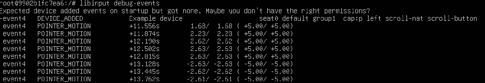
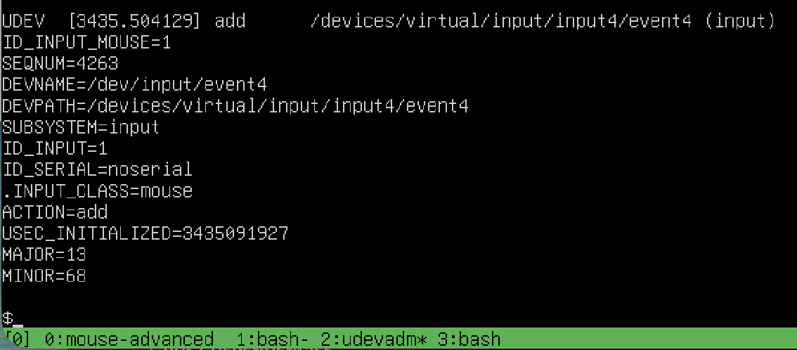
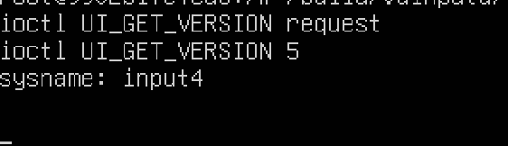
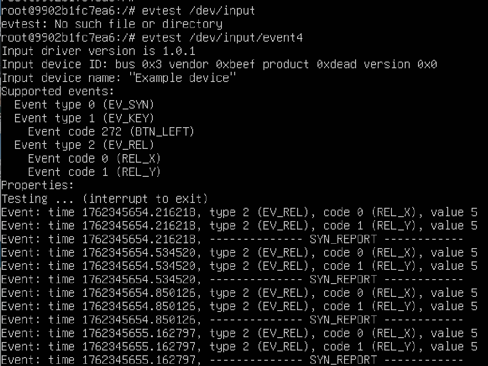
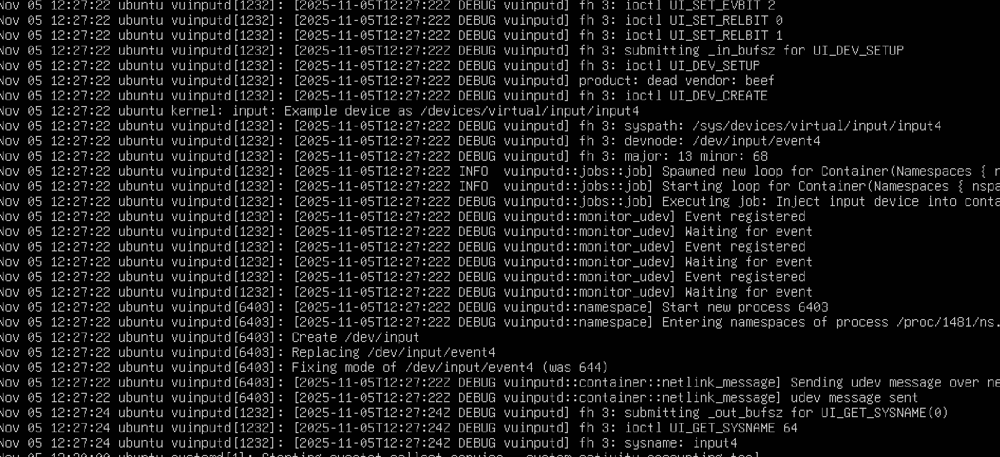

# Host

Assumption vuinputd is running.

## docker
```
sudo bash
apt-get install docker.io
# first time
docker run -it --name vuinput-test --device=/dev/vuinput:/dev/uinput --device-cgroup-rule='c 13:* rw' --mount type=bind,src=(insert build directory here),dst=/build ubuntu:noble
# subsequent times
# docker start -ia vuinput-test
```
Now continue with the instructions given below in section Inside Container. Afterwards, you can remove the container with `docker rm vuinput-test`.

## systemd-nspawn

TODO: more details

Install mkosi from https://github.com/systemd/mkosi. Manual is on https://github.com/systemd/mkosi/blob/main/mkosi/resources/man/mkosi.1.md

Create a Ubuntu 24.04 with `mkosi -d ubuntu -r noble -t directory ubuntu-dir

```
/usr/bin/systemd-nspawn -M gamestreamingserver -D ubuntu-dir --network-veth --system-call-filter="@keyring bpf" --bind=/proc:/run/proc --bind=/sys:/run/sys --bind=/dev/vuinput:/dev/uinput --bind=/dev/dri --property="DeviceAllow=char-drm rw" -b --property="DeviceAllow=char-input rw" --property="DeviceAllow=/dev/vuinput rw"
```

## lxd/lxc

TODO: more details
```
lxc.cgroup2.devices.allow: c 120:414795 rwm
lxc.mount.entry: /dev/vuinput dev/uinput none bind,optional,create=file

```

# Inside Container
```
chmod 666 /dev/uinput
apt-get update
# install test tools (not necessary for production)
apt-get install libinput-tools udev evtest tmux
# create dummy files (necessary for production)
mkdir -p /run/udev/data/
touch /run/udev/control

# now for the test open a tmux session with four windows
# see https://tmuxcheatsheet.com/
# to create a window, press Ctrl+b, then c
# to switch to the next window, press Ctrl+b, then n (next)
libinput debug-events
udevadm monitor -p
evtest /dev/input/event*
/build/release/mouse-advanced
```

Sample output from `libinput debug-events`:  


Sample output from `udevadm monitor -p`:  


Sample output from `mouse-advanced`:  


Sample output from `evtest`:  
 

Sample output from `journalctl` showing vuinputd output:  
  