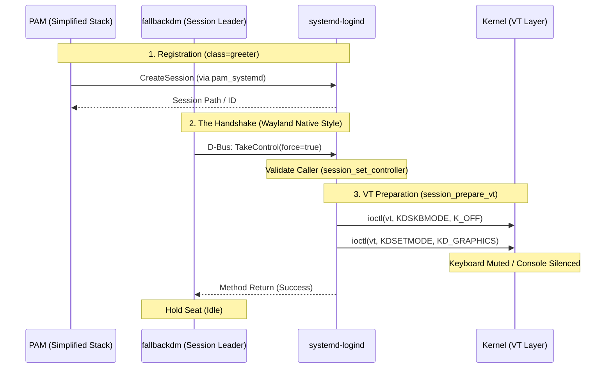

# DESIGN.md
## 1. Design Philosophy: Standardized Infrastructure

The core design principle of `fallbackdm` is to **utilize established systemd interfaces** to solve the "Empty Seat" problem.

In a modern Linux ecosystem, hardware resource arbitration has moved away from direct device manipulation by individual applications. `systemd-logind` now acts as the central arbiter for seats, sessions, and terminal states.

`fallbackdm` is designed to be a "minimalist citizen" of this architecture. Instead of implementing a full graphical stack to "own" the hardware, it leverages the fact that the kernel and `logind` already provide a mechanism to mute VTs and protect input streams. By registering as a formal session controller, `fallbackdm` ensures the system remains in a "graphical-ready" state—silencing the legacy text console—without the overhead of an actual display server.

## 2. The Mechanism: The `TakeControl` Handshake

The critical functionality of `fallbackdm`—silencing the kernel terminal to prevent input leakage—is achieved through a single, standardized D-Bus handshake: `TakeControl`.

This mechanism replaces manual `ioctl` calls. By invoking the `TakeControl` method on the `org.freedesktop.login1.Session` interface, `fallbackdm` triggers a privileged workflow inside `logind` that safely transitions the machine state.

### 2.1 The Internal Workflow

When `fallbackdm` calls `TakeControl`, it triggers the following verified code path within `systemd-logind` (as referenced in `logind-session.c`):

1. **Permission Check:** `logind` verifies the caller owns the session.
2. **Controller Assignment:** `session_set_controller()` marks `fallbackdm` as the active display server.
3. **VT Preparation:** `logind` executes `session_prepare_vt()`, which performs the privileged operations:
* **Mute Input:** Calls `ioctl(vt, KDSKBMODE, K_OFF)`. This effectively disconnects the kernel console from the keyboard, preventing `getty` or the kernel from interpreting keystrokes.
* **Graphics Mode:** Calls `ioctl(vt, KDSETMODE, KD_GRAPHICS)`. This disables the blinking cursor and text rendering.
* **Signal Handling:** Configures the VT to send signals (like `SIGUSR1`) for switching, rather than automatically switching context.

**Result:** `fallbackdm` achieves a "muted" state without ever needing to open a device file or possess `CAP_SYS_TTY_CONFIG` capabilities directly.

## 3. Industry Precedent: The Standard Stack

`fallbackdm` does not invent a new protocol; it isolates the infrastructure logic used by modern Linux desktops. To understand why `fallbackdm` works, we must look at how the **Wayland Native** stack (GDM and Mutter) handles seat ownership.

### 3.1 Foundational Concepts: Seats, Sessions, and Leaders

On a modern system, hardware access is governed by several distinct layers:

* **The Seat (e.g., `seat0`):** A collection of hardware (GPU, Keyboard, Mouse).
* **The Session:** An instance of a user (or service) interacting with a seat.
* **The Session Leader:** The primary process responsible for the session. In a graphical world, this is the **Compositor** (Mutter).
* **The Display Manager (GDM):** A supervisor that manages the lifecycle of sessions.

In the **Wayland Native** workflow, the compositor (Mutter) serves as the "Display Server." It talks directly to the kernel for graphics (DRM/KMS) and input (libinput). However, it does not "steal" these resources; it asks `systemd-logind` for permission.

### 3.2 Technical Execution: PAM and the Handshake

The transition from a text-based boot to a graphical environment follows a strict sequence. `fallbackdm` mimics the first half of this cycle:

#### 1. Simplified Session Registration (The PAM Layer)

Before a process can "Take Control" of a seat, a session must exist. GDM initiates this via a specialized, minimalist PAM stack (e.g., `gdm-launch-environment.pam`).

Following the GDM precedent, `fallbackdm` uses a simplified PAM stack because a greeter/placeholder session **has no password and cannot be locked.** This removes the overhead of full `system-auth` account and password modules, focusing strictly on:

* Setting up the environment (`pam_env.so`).
* Permitting the session entry (`pam_permit.so`).
* Registering the session with `logind` via `pam_systemd.so` as `class=greeter`.

#### 2. Claiming the Seat (The D-Bus Layer)

Once registered, the Session Leader (Mutter in a standard setup, `fallbackdm` in ours) must claim the seat. The process calls `TakeControl(force=true)` on its own Session object via D-Bus. `logind` validates that the caller is the registered leader and then performs the privileged "silencing" of the VT.

### 3.3 Sequence & Implementation Mapping

#### Source References for Verification

* **GDM (PAM):** `data/gdm-launch-environment.pam` — Demonstrates the minimalist "don't run full account/password stacks" approach for greeters.
* **GDM (PAM):** `src/daemon/gdm-session-worker.c` — Shows how the minimalist pam session is started via `gdm_session_worker_initialize_pam`.
* **systemd-logind:** `src/login/logind-session-dbus.c` — see `method_take_control()`.
* **systemd-logind:** `src/login/logind-session.c` — see `session_prepare_vt()` (where the `K_OFF` and `KD_GRAPHICS` ioctls live).
* **Mutter:** `src/backends/native/meta-launcher.c` — see `meta_launcher_new()` where the D-Bus proxy for the session is created and `TakeControl` is called.
* **GDM:** `daemon/gdm-manager.c` — see `set_up_greeter_session()` which coordinates the PAM transition.

### 3.4 The Parallel

* **Standard DM:** `PAM` → `Mutter` → **`TakeControl`** → *Open DRM/Input Devices*
* **fallbackdm:** `PAM` → `fallbackdm` → **`TakeControl`** → *Wait/Idle*

By stopping after the `TakeControl` handshake, `fallbackdm` provides the exact same system-level protection as a full desktop environment with zero overhead and a vastly smaller attack surface.

## 4. Alignment with Systemd Guidelines

The design strictly adheres to the *[Writing Display Managers](https://systemd.io/WRITING_DISPLAY_MANAGERS/)* specification provided by the systemd project.

| Systemd Requirement | `fallbackdm` Implementation |
| --- | --- |
| **"Register via PAM"** | `fallbackdm` uses `pam_systemd.so` with `class=greeter` to register a valid session. |
| **"Take possession"** | We use the `TakeControl` D-Bus method to explicitly claim the seat. |
| **"Passive C API"** | We use `sd-login` (or equivalent D-Bus calls) to identify the seat, avoiding manual parsing of `/var/run` or `/proc`. |
| **"Minimal Porting"** | By offloading VT management to `logind`, we achieve the "Minimal porting" goal described in the docs, removing legacy ConsoleKit/ioctl code. |

## 5. Security & Stability Implications

### 5.1 Adherence to Least Privilege

By using `logind` as a proxy for hardware configuration, `fallbackdm` avoids the need for:

* `CAP_SYS_TTY_CONFIG`: No need to configure TTYs directly.
* Device Node Access: No need to open `/dev/ttyX` or `/dev/input/eventX`.
* Root Privileges: `fallbackdm` can run as a dedicated unprivileged system user, as `logind` validates the `TakeControl` request based on session ownership, not UID 0.

### 5.2 Graceful Handover

Because `fallbackdm` is a "polite" session controller:

* When a real DM (like GDM) starts, it triggers a new session or requests the seat.
* `logind` manages the transition, and `fallbackdm` yields or exits based on standard D-Bus signals (`ReleaseSession`).
* This ensures no "input blips" where the keyboard reverts to text mode during the split-second transition between `fallbackdm` and a real compositor.

## 6. Summary

The design of `fallbackdm` is not a workaround; it is a **canonical implementation of a headless systemd session controller**.

By leveraging the `TakeControl` API, we utilize the exact mechanism built for this purpose, supported by the kernel and `systemd` developers, and battle-tested by GNOME and KDE. This ensures that the "Input Leakage" problem is solved at the infrastructure level, where it belongs.